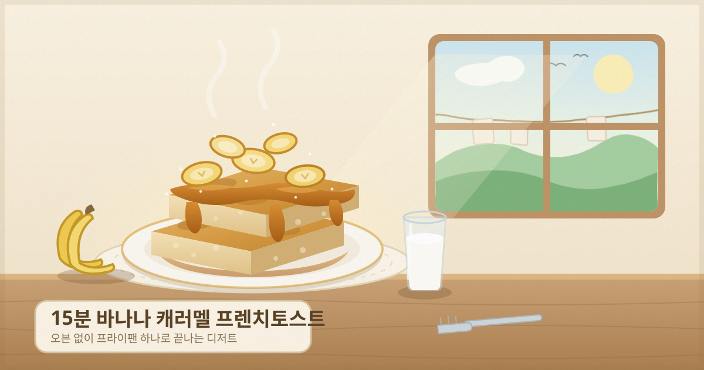

# 15분 바나나 캐러멜 프렌치토스트

오븐 없이 프라이팬 하나로 끝나는 디저트.
겉은 버터에 지져 바삭하고 속은 커스터드처럼 촉촉한 식빵 위에, 직접 졸인 바나나 캐러멜을 얹습니다.

- **소요 시간**: 15분 (준비 5분 + 조리 10분)
- **분량**: 2인분 (식빵 2장)
- **난이도**: 쉬움

---

## 재료

### 프렌치토스트
| 재료 | 분량 |
| --- | --- |
| 두꺼운 식빵 | 2장 (2cm 두께) |
| 계란 | 1개 |
| 우유 | 100ml |
| 설탕 | 1큰술 |
| 바닐라 익스트랙 | 2~3방울 (선택) |
| 소금 | 한 꼬집 |
| 버터 | 1큰술 |

### 바나나 캐러멜
| 재료 | 분량 |
| --- | --- |
| 바나나 | 1개 |
| 설탕 | 2큰술 |
| 버터 | 1큰술 |
| 생크림(또는 우유) | 2큰술 |
| 소금 | 한 꼬집 |

> 식빵은 **하루 지나 살짝 마른 것**이 가장 좋습니다. 갓 산 촉촉한 빵은 계란물을 머금고 쉽게 찢어집니다.

---

## 조리 순서

### 1. 계란물 만들기 (0~3분)
볼에 계란 1개, 우유 100ml, 설탕 1큰술, 소금 한 꼬집, 바닐라를 넣고 **알끈이 풀릴 때까지** 충분히 섞습니다.
체에 한 번 내리면 훨씬 매끈해집니다.

### 2. 식빵 적시기 (3~6분)
식빵을 계란물에 담가 **한 면당 1분 30초씩** 적십니다. 손가락으로 살짝 눌러 물기가 배어 나오면 충분합니다.

> 오래 담그면 부서지고, 짧게 담그면 속이 퍽퍽합니다. 3분을 넘기지 마세요.

### 3. 캐러멜 졸이기 (6~10분) — 빵 적시는 동안
팬에 설탕 2큰술을 펴 넣고 **약불에서 젓지 말고** 2~3분 그대로 녹입니다.
가장자리부터 갈색이 되면 팬을 살살 돌려 색을 고르게 맞춥니다.
호박색이 되면 불을 끄고 버터 1큰술 → 생크림 2큰술 → 소금 순으로 넣고 재빨리 섞습니다.
어슷 썬 바나나를 넣어 캐러멜을 입힌 뒤 접시에 덜어 둡니다.

> 생크림을 넣으면 순간적으로 확 끓어오릅니다. 불을 반드시 끄고 넣으세요.

### 4. 굽기 (10~14분)
팬을 닦고 버터 1큰술을 녹인 뒤 **중약불**에서 식빵을 굽습니다.
한 면당 2분, 가장자리가 진한 갈색이 될 때까지. 뒤집을 때는 뒤집개로 한 번에.

> 센 불에서 구우면 겉만 타고 속의 계란물이 익지 않습니다. 중약불 + 2분이 기준.

### 5. 담기 (14~15분)
접시에 토스트를 담고 바나나 캐러멜을 듬뿍 올립니다.
슈거파우더나 시나몬 가루를 뿌려 마무리하세요.

---

## 실패하지 않는 팁

- **캐러멜을 저으면 설탕이 결정으로 굳습니다.** 팬을 돌리기만 하고 절대 젓지 마세요.
- **캐러멜이 굳어 버렸다면** 생크림 1큰술을 더 넣고 약불에서 30초 데우면 다시 풀립니다.
- **속이 덜 익었다면** 뚜껑을 덮고 약불로 1분 더 두세요. 겉을 더 태우지 않고 속만 익습니다.
- **바나나는 검은 반점이 생긴 것**이 단맛이 강해 설탕을 줄일 수 있습니다.

## 응용

| 추가 재료 | 넣는 시점 |
| --- | --- |
| 바닐라 아이스크림 | 접시에 담은 직후 (따뜻할 때) |
| 견과류(피칸 · 호두) | 캐러멜에 바나나와 함께 |
| 시나몬 가루 | 계란물에 1/4작은술 |
| 크림치즈 | 식빵 두 장 사이에 발라 샌드로 |
| 럼 · 브랜디 | 캐러멜 마지막에 1작은술 (어른용) |
