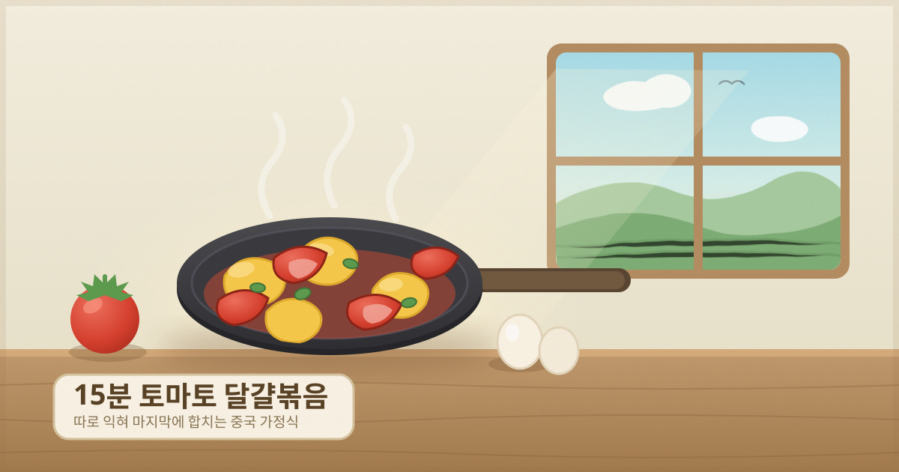

# 15분 토마토 달걀볶음

중국 가정식의 국민 반찬 '시홍스 차오지단'.
달걀은 부드럽게, 토마토는 과즙이 살아 있게 — 따로 익혀 마지막에 합치는 것이 핵심입니다.

- **소요 시간**: 15분 (준비 5분 + 조리 10분)
- **분량**: 2인분
- **난이도**: 쉬움

---

## 재료

| 재료 | 분량 |
| --- | --- |
| 완숙 토마토 | 중간 크기 2개 (400g) |
| 계란 | 3개 |
| 대파 | 1/2대 |
| 다진 마늘 | 1/2큰술 |
| 설탕 | 1작은술 |
| 소금 | 1/2작은술 |
| 굴소스 | 1작은술 (선택) |
| 식용유 | 3큰술 |
| 참기름 | 1작은술 |

> 설탕은 단맛을 내려는 게 아니라 **토마토의 신맛을 눌러 감칠맛을 세우는** 역할입니다. 빼지 마세요.

---

## 조리 순서

### 1. 재료 손질 (0~4분)
토마토는 꼭지를 제거하고 한입 크기(6~8등분) 웨지로 썹니다.
대파는 송송 썰고, 계란 3개는 소금 한 꼬집과 함께 완전히 풀어 둡니다.

### 2. 달걀 먼저 익히기 (4~7분)
팬에 식용유 2큰술을 두르고 **연기가 살짝 오를 만큼** 센 불로 달굽니다.
풀어 둔 계란을 한 번에 붓고 5초 기다린 뒤, 가장자리부터 크게 저어 올립니다.
80% 정도 익어 몽글몽글해지면 **바로 그릇에 덜어 둡니다.**

> 여기서 완전히 익히면 나중에 합칠 때 퍽퍽해집니다. 살짝 덜 익은 상태로 빼는 게 정답.

### 3. 토마토 볶기 (7~11분)
같은 팬에 남은 기름 1큰술과 대파, 다진 마늘을 넣고 30초 볶아 향을 냅니다.
토마토를 넣고 중강불에서 2~3분 볶습니다. 가장자리가 허물어지고 즙이 나오기 시작하면 됩니다.

### 4. 간 맞추기 (11~13분)
설탕 1작은술, 소금 1/2작은술, 굴소스 1작은술을 넣고 30초 더 볶습니다.
국물이 자작하게 생기면 그대로 두세요. 이 국물이 밥에 비벼 먹는 소스가 됩니다.

### 5. 합치기 (13~15분)
덜어 둔 달걀을 다시 팬에 넣고 **10~20초만** 가볍게 섞습니다.
불을 끄고 참기름을 두른 뒤 접시에 담습니다.

---

## 실패하지 않는 팁

- **팬을 충분히 달굴 것.** 미지근한 팬에 계란을 부으면 눌어붙고 물기가 생깁니다.
- **토마토는 완숙으로.** 덜 익은 토마토는 신맛만 강하고 즙이 안 나옵니다.
- **물을 넣지 마세요.** 토마토에서 나오는 즙만으로 충분합니다.
- **덜 익은 달걀이 걱정된다면** 3단계 중강불에서 합치고 20초 더 볶으면 안전합니다.

## 응용

| 추가 재료 | 넣는 시점 |
| --- | --- |
| 두부 | 토마토와 함께 볶기 |
| 새우 | 계란 익히기 전에 먼저 볶아 빼두기 |
| 청양고추 | 대파·마늘과 함께 |
| 국수(소면) | 삶아서 소스에 비벼 먹기 |
